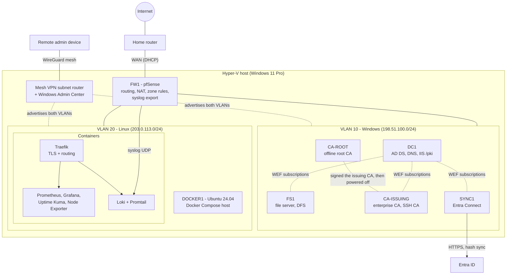

# Home Lab: Windows + Linux Infrastructure

A two-track lab on a single Hyper-V host (Windows 11 Pro, 32 GB RAM). One track is an
enterprise-pattern Windows environment: Active Directory, a two-tier PKI, hybrid identity
with Entra ID, file services and Group Policy. The other is a Linux/Docker host running
monitoring, logging and a reverse proxy. A pfSense firewall segments the two, and a mesh VPN
provides remote access. Everything is documented, scripted, and rebuildable from config.

All hostnames, domains and addresses in this repository are placeholders (`example.com`
and RFC 5737 documentation ranges). No real names, keys or credentials appear here.

## Architecture

## What's in the lab

| Component | What it does | Skills demonstrated |
|---|---|---|
| AD DS forest on DC1 | Directory, DNS, OU design, users, groups, Windows LAPS | Active Directory administration, delegation, least privilege |
| Group Policy | Domain password policy, workstation security baseline, drive mappings | GPO design, OU-based targeting, SMB hardening |
| FS1 | SMB shares with NTFS-only permissions, DFS namespace | File services, permission models, DFS |
| Two-tier PKI | Offline root CA, online enterprise issuing CA, HTTP CRL/AIA publication, autoenrollment, LDAPS | ADCS, certificate lifecycle, CRL management |
| Hybrid identity | Entra Connect (password hash sync), public UPN suffix | Entra ID, sync troubleshooting, sign-in log analysis |
| FW1 (pfSense) | Routing, NAT, aliases, logged segmentation gate, invert-match egress | Firewall policy, VLAN segmentation, change rollout |
| Remote access | Mesh VPN subnet router, Windows Admin Center, SSH certificate authority | VPN, SSH PKI, remote administration |
| DOCKER1 | Ubuntu 24.04, Docker Engine, Compose stacks, AD-joined via SSSD | Linux administration, containers, AD integration |
| Traefik | Label-driven reverse proxy, internal-CA wildcard certificate | TLS termination, DNS, certificate issuance |
| Prometheus, Grafana, Uptime Kuma | Metrics, dashboards, 12 availability monitors | Monitoring and alerting design |
| Loki + Promtail | Container logs and pfSense syslog, 14-day retention | Log aggregation, LogQL, retention |
| Windows Event Forwarding | Collector on the DC, four subscriptions, audit policy | Windows auditing, event IDs, Kerberos-based forwarding |
| `Lab/` rebuild system | Config-driven, idempotent PowerShell phases with dependency ordering | PowerShell 7, infrastructure as code, verification |

Wazuh SIEM was scoped and deliberately deferred: the host does not have the RAM headroom for
the indexer alongside everything else.

## How I run it

- **Tickets.** Changes are tracked as `HL-####` tickets: symptom or goal, diagnosis, plan,
  execution notes, verification, rollback plan and captured evidence. A rebuild after
  downtime was planned as a 16-ticket sprint, worked in order from a board capped at two
  items in progress.
- **Runbooks.** Repeatable procedures live in runbooks, including a cold-start order for the
  whole lab (firewall, then DC, then CAs, then file server, then sync server, then Linux) and a
  daily health-check shift.
- **Troubleshooting log.** A running log holds 89 numbered entries, each a mistake that cost
  time and the fix. Six are written up in [troubleshooting-highlights](write-ups/troubleshooting-highlights.md).
- **Idempotent rebuild.** The `Lab/` system declares state in config files and applies it in
  dependency order. `-WhatIf` prints the resolved phase order without changing anything.
  Details in [rebuild-automation](write-ups/rebuild-automation.md).
- **Design decisions are written down.** An architecture-decisions log records each choice
  and the reason, for example why the root CA stays offline and why egress rules use an
  inverted destination match.
- **AI-assisted, human-run.** Work is done by hand first, then codified into scripts. AI
  assistance is used to draft tickets, scaffold scripts and review output; I run every lab
  command myself, and nothing goes into the repo without review.

## Write-ups

| Topic | Write-up |
|---|---|
| AD DS, two-tier PKI, hybrid identity, LAPS, GPO baseline | [identity](write-ups/identity.md) |
| pfSense zone policy and the four-phase rule rollout | [network-segmentation](write-ups/network-segmentation.md) |
| Prometheus, Grafana, Loki, Uptime Kuma, WEF, syslog | [monitoring-and-logging](write-ups/monitoring-and-logging.md) |
| Mesh VPN, SSH certificate authority, Traefik | [remote-access](write-ups/remote-access.md) |
| Declarative PowerShell rebuild system | [rebuild-automation](write-ups/rebuild-automation.md) |
| Six real problems, symptom to lesson | [troubleshooting-highlights](write-ups/troubleshooting-highlights.md) |

Short PowerShell excerpts showing the style are in [samples/](samples/).

## Stack

Windows Server, Windows 11, Hyper-V, Active Directory, ADCS, Group Policy, Entra ID / Entra
Connect, pfSense, Ubuntu Server 24.04, Docker Compose, Traefik, Prometheus, Grafana, Loki,
Promtail, Uptime Kuma, Windows Event Forwarding, OpenSSH certificates, WireGuard-based mesh
VPN, PowerShell 7.
